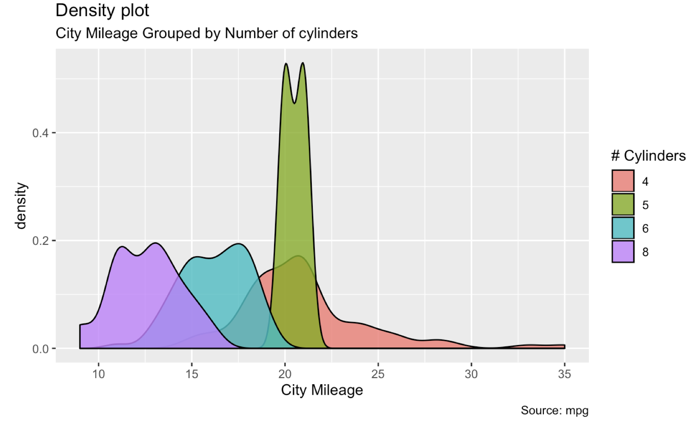

# Exercise

* Exercise 1: `midwest` is a dataset in `ggplot2`, and contains demographic information of midwest counties. Replicate the following scatterplot as close as you can. The variable for the x-axis, y-axis, color aesthetic, size aesthetic are `area`, `poptotal`, `state`, and `popdensity`. 

 

* Excercise 2: Replicate the following barplot using the `mpg` dataset. Use `theme(axis.text.x = element_text(angle=65, vjust=0.6))`. Check why we need this theme by plotting with and without this theme. You also need `width = 0.5` option in a geom to have more space between bar. 

 

* Excercise 3: Replicate the following density plot using the `mpg` dataset. You need an `alpha` aesthetic to make densities transparent. 

 

