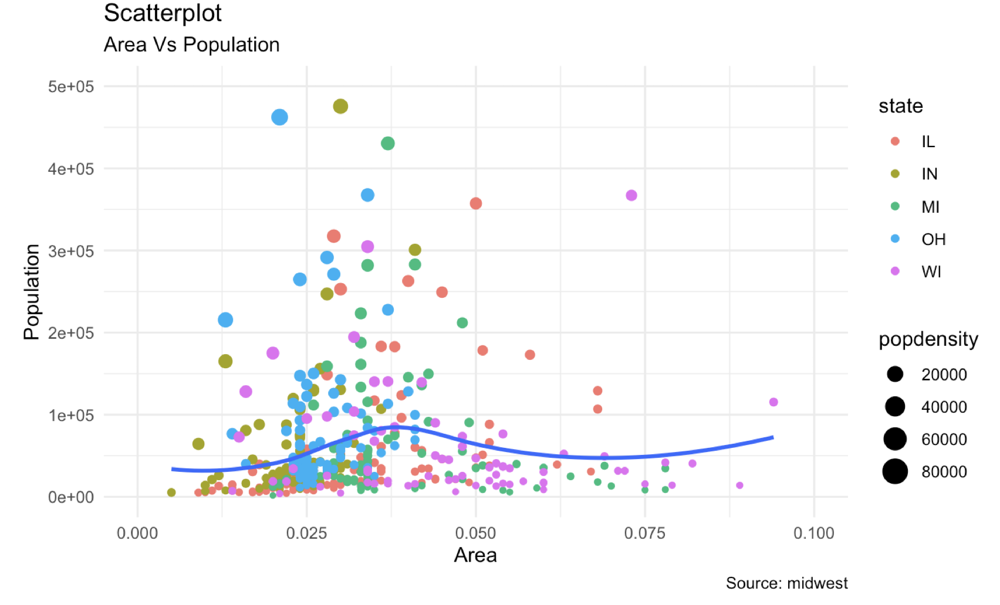
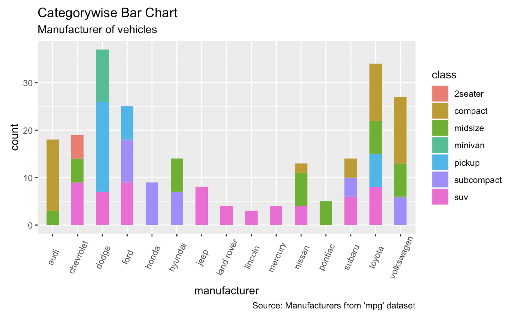

--- 
title: "R, Rstudio, and ggplot2"
author: "Sunbok Lee"
date: "`r Sys.Date()`"
site: bookdown::bookdown_site
output: bookdown::gitbook
documentclass: book
bibliography: [book.bib]
biblio-style: apalike
link-citations: yes
#github-repo: rstudio/bookdown-demo
description: "This is an introduction to R, Rstudio, and ggplot2"
---

# R 

## Why R? 
* R is a **free** open source software.
* R is a language designed especially for **statistical analysis**. Many statistical methods are first implemented in R. 
* R provides many tools for publication-quality **data visualization** (e.g., `ggplot2`).
* R provides many tools for **data processing (or data wrangling)** (e.g., `dplyr`, `tidyr`). Data come from diverse sources these days (e.g., microarray, EEG, fMRI, eyetrackers, facebook, twitter, many sensors, ... ).
    * e.g., JSON is a popular file format for data exchange: [https://en.wikipedia.org/wiki/JSON](https://en.wikipedia.org/wiki/JSON)
    * e.g., Biometric research: [IMotions](https://imotions.com/?creative=287840870074&keyword=imotions&matchtype=p&network=g&device=c&gclid=EAIaIQobChMI3pas5oOO5AIVlBx9Ch28hwboEAAYASAAEgJlUfD_BwE)

## Installing R

* You can download and install **a base distribution and packages (base R)** from the official R webiste: [https://www.r-project.org](https://www.r-project.org).

* About 14,000 packages **extend** the base R. R packages are **collections of functions and data sets** developed by the R community. They increase the power of R by improving existing base R functionalities. A list of R packages are available here:[https://cran.r-project.org/web/packages/available_packages_by_name.html](https://cran.r-project.org/web/packages/available_packages_by_name.html)

## Installing RStudio

* RStudio is an **integrated development environment (IDE)** for R. 

* You can download and install the RStudio from the RStudio website: [https://www.rstudio.com](https://www.rstudio.com). 

* A short tour to the RStudio IDE: [https://www.rstudio.com/products/rstudio/](https://www.rstudio.com/products/rstudio/). 

## Cheat Sheets for R

* RStudio provides cheat sheets for R: [https://www.rstudio.com/resources/cheatsheets/](https://www.rstudio.com/resources/cheatsheets/). 

## Rmarkdown files

* Rmarkdown files for this materials can be downloaded here: [https://github.com/sunboklee/PSYC6300](https://github.com/sunboklee/PSYC6300)

## R topics covered in this course

* Base R
* tidyverse 
    * The `tidyverse` package was developed for more efficient data science in R. In the `tidyverse` package, the `dplyr`, `tidyr`, `ggplot2`, and `purrr` packages provide many useful functions for efficient data transformation, data tidying, data visualization, and iteration, respectively.
    * Useful free R books: [https://bookdown.org](https://bookdown.org). R for Data Science [@Wickham] is a useful resource for the `tidyverse` package. 
  
  


<!--chapter:end:index.Rmd-->

# Introduction to `ggplot2`

## What is `ggplot2`

* The `ggplot2` package [@ggplot2] was developed to build a graphic from **few graphical components** (e.g., data, coordinate systems, geometric objects, aesthetics, facets, themes) based on the **grammar of graphics**. 

> "Wilkinson (2005) created the **grammar of graphics** to describe the deep features that underlie all statistical graphics. The grammar of graphics is an answer to a question: **what is a statistical graphic?** The **layered grammar of graphics** (Wickham, 2009) builds on Wilkinson’s grammar, focussing on the primacy of **layers** and adapting it for embedding within R. In brief, the grammar tells us that a statistical graphic is a **mapping** from **data** to **aesthetic attributes (colour, shape, size) of geometric objects (points, lines, bars)**. The plot may also contain **statistical transformations** of the data and is drawn on a specific **coordinate system**. **Faceting** can be used to generate the same plot for different subsets of the dataset. It is the combination of these independent components that make up a graphic."
>
> --- @ggplot2

* The components of `ggplot2`
    * Data
    * Geometric objects (**geom** for short)
    * Aesthetic mappings
    * Statistical transformations (**stats** for short)
    * Scales
    * A coordinate system (**coord** for short)
    * A faceting 

* Install the `tidyverse` package (or any package)
    * using `install.packages()` function
    * using the `Packages` pane 
    
```{r, eval = FALSE}
install.packages("tidyverse")
```
    
* Load the `tidyverse` package onto memory

```{r}
# We need to load a package whenever we use it
suppressMessages(library(tidyverse)) 
```


## Data

* "The **data** are what you want to visualise and a set of **aesthetic mappings** describe how **variables in the data** are mapped to **aesthetic attributes** that you can perceive." [@ggplot2]

```{r}
# diamonds is a built-in data in ggplot2
# ?diamonds display the help document for data 
# tibble is a datastructure in tidyverse 
diamonds
```


## Geometric objects (**geoms**)

* "Geometric objects, geoms for short, represent **what you actually see** on the plot: **points**, **lines**, **polygons**, etc." [@ggplot2]

```{r}
# ggplot() initializes a ggplot object.
# it can be used to specify 1) a dataset, and 2) aesthetic mapping
ggplot(data = diamonds, aes(x = carat, y = price))
```


```{r}
# geom_points() adds a new layer to a plot by drawing points to produce a scatter plot 
ggplot(data = diamonds, aes(x = carat, y = price)) + geom_point()
```

```{r}
# geom_smooth() adds an additional layer to the plot by drawing a smoothed line to capture the trend in the scatterplot
ggplot(data = diamonds, aes(x = carat, y = price)) + geom_point() + geom_smooth()
```


## Exercise 

* typing `mtcars` in your console will display the content of the `mtcars` dataset. How can we display the help document for the `mtcars` data?

* type `head(mtcars)`. What did `head()` do? Check the help document of `head()` (`mtcar` is a dataframe in base R, whereas the `diamonds` is a tibble in `tidyverse`). 

* Using the `mtcars` data, plot the scatter plot between `mpg` (miles per gallon: y axis) and `disp` (displacement: x axis) with a smoothed line. 

## Aesthetic mappings

* "A set of aesthetic mappings describe how **variables in the data** are mapped to **aesthetic properties** of the layer" [@ggplot2] 

* "To describe the way that **variables in the data** are mapped to **things that we can perceive on the plot (the "aesthetics")**, we use the `aes` function. The `aes` function takes a list of aesthetic-variable pairs like these: `aes(x = weight, y = height, colour = age)`. Here we are mapping x-position to `weight`, y-position to `height` and colour to `age`. The first two arguments can be left without names, in which case they correspond to the x and y variables." [@ggplot2]

```{r}
# color = color maps the variable 'color` in the dataset to the color aesthetics of points to encode further information in the graphic. 
ggplot(data = diamonds, aes(x = carat, y = price, color = color)) + geom_point()
```

```{r}
# shape = cut maps the variable 'cut` in the dataset to the shape aesthetics of points to encode further information in the graphic. 
# the graphic is not so informative because points are overplotted. Sometimes, facetting may handle overplotting 
ggplot(data = diamonds, aes(x = carat, y = price, shape = cut)) + geom_point()
```

```{r}
ggplot(data = diamonds, aes(x = carat, y = price)) + geom_point(color = "blue")
```


## Exercise 

* `mpg` is similar to `mtcars` but is a built-in tibble in `ggplot2`. 1) Plot `hwy` (mile per gallon: y axis) against `displ` (engine displancement: x axis), 2) Given the plot from 1), map the `class` variable to color, shape, alpha, and size aesthetics. 


* Explain what happens. 

```{r}
ggplot(data = mpg, mapping = aes(x = displ, y = hwy, color=drv)) + geom_point() + geom_smooth(method="lm")
```

* This is what happens when mapping `hyw`, `displ`, and `cyl` to `x`, `y`, and `color` aesthetics. R creates a new dataset that contains all the data to be displayed on the plot. 

x    |y    |color
-----|-----|-----
1.8  |29   |4
1.8  |29   |4
2.0  |31   |4
2.0  |30   |4
2.8  |26   |6
2.8  |26   |6
3.1  |27   |6
1.8  |26   |4
1.8  |25   |4
2.0  |28   |4


## Scales 

* In the previous table, computers don't know how to display colors based on 4, 6, ... Computers need a a hexadecimal code for colors such as `FF6C91`. The mapping from the data to the final values that computers can use to display aesthetics is called a scale. 

* "The scales map values in the data space to values in an aesthetic space, whether it be colour, or size, or shape. Scales draw a legend or axes, which provide an inverse mapping to make it possible to read the original data values from the graph." [@ggplot2]

* `scale_x_continuous()` and `scale_y_continuous()` are the default scales for continuous x and y aesthetics: [https://ggplot2.tidyverse.org/reference/scale_continuous.html](https://ggplot2.tidyverse.org/reference/scale_continuous.html). 

```{r}
p1 <- ggplot(mpg, aes(displ, hwy)) + geom_point()
p1
```


```{r}
# change the axis labels
p1 + scale_x_continuous("Engine displacement (L)") +
  scale_y_continuous("Highway MPG")
```


```{r}
# also use the short-cut labs()
p1 + labs(x = "Engine displacement (L)", y = "Highway MPG")
```


```{r}
# modify the axis limits
p1 + scale_x_continuous(limits = c(2, 6))
```

```{r}
# use the short hand functions `xlim()` and `ylim()`
p1 + xlim(2, 6)
```

```{r}
#  choose where the ticks appear
p1 + scale_x_continuous(breaks = c(2, 4, 6))
```

```{r}
#  choose your own labels
p1 + scale_x_continuous(breaks = c(2, 4, 6), label = c("two", "four", "six"))
```


```{r}
ggplot(data = mpg, mapping = aes(x = displ, y = hwy, color=drv)) + geom_point() + geom_smooth(method="lm") + labs(title ="MPG vs Engine size", x = "Engine size", y = "MPG")
```


```{r}
# Create your own discrete scale
ggplot(data = mpg, mapping = aes(x = displ, y = hwy, color=drv)) + geom_point() + geom_smooth(method="lm") + labs(title ="MPG vs Engine size", x = "Engine size", y = "MPG") + scale_colour_manual(name = "Drive", values = c("lightpink", "darkseagreen", "lightblue"))
```


```{r}
ggplot(data = mpg, mapping = aes(x = displ, y = hwy, color=cty)) + geom_point() 
```

```{r}
ggplot(data = mpg, mapping = aes(x = displ, y = hwy, color=cty)) + geom_point() + scale_colour_gradient(name = "City MPG", low = "red", high = "blue")
```


* For more details about scales, see [https://ggplot2.tidyverse.org/reference/](https://ggplot2.tidyverse.org/reference/). 

* Colors in R: [http://www.sthda.com/english/wiki/colors-in-r](http://www.sthda.com/english/wiki/colors-in-r)


## Statistical transformations (**stats** for short)

```{r}
# historam shows the distribution of a single variable. 
# where does count come from? 
ggplot(data = diamonds, aes(x = carat)) + geom_histogram()
```

* "Statistical transformations, **stats** for short, summarise data in many useful ways. For example, binning and counting observations to create a histogram, or summarising a 2d relationship with a linear model. Stats are optional, but very useful." [@ggplot2]

* How `geom_histogram()` works? 
    * "A stat takes a dataset as input and returns a dataset as output, and so a stat can add new variables to the original dataset. It is possible to map aesthetics to these new variables. For example, `stat_bin`, the statistic used to make histograms, produces the following variables:
        * `count`, the number of observations in each bin
        * `density`, the density of observations in each bin (percentage of total / bar
width)
        * `x`, the centre of the bin" [@ggplot2]
    * "These generated variables can be used instead of the variables present in
the original dataset. For example, the default histogram geom assigns the height of the bars to the number of observations (`count`), but if you’d prefer a more traditional histogram, you can use the density (`density`). The following example shows a density histogram of carat from the diamonds dataset." [@ggplot2]

```{r}
# The names of generated variables must be surrounded with ..
 ggplot(diamonds, aes(carat)) + geom_histogram(aes(y = ..density..), binwidth = 0.1)
```

* Every **geom** has a default **stats**. 

* Position adjustments
    * Position adjustments determine how to arrange **geoms** that would otherwise occupy the same space. 

```{r}
# The discrete analogue of histogram is the bar plot
s <- ggplot(mpg, aes(fl, fill = drv))
```

```{r}
s + geom_bar()
```

```{r}
# Stack elements on top of one another
s + geom_bar(position = "stack")
``` 

```{r}
# Arrange elements side by side
s + geom_bar(position = "dodge")
```

```{r}
# Stack elements on top of one another,normalize height
s + geom_bar(position = "fill")
```

## A faceting 

* "A faceting specification describes how to break up the data into **subsets** and how to display those subsets as **small multiples**. This is also known as **conditioning** or latticing/trellising." [@ggplot2]

* "There are two types of faceting provided by ggplot2: `facet_grid` and `facet_wrap`. Facet grid produces a 2d grid of panels defined by variables which form the rows and columns, while facet wrap produces a 1d ribbon of panels that is wrapped into 2d" [@ggplot2]

```{r}
# facet into rows
ggplot(data = diamonds, aes(x = carat)) + geom_histogram() + facet_grid(color ~ .)
```

```{r}
# facet into columns
ggplot(data = diamonds, aes(x = carat)) + geom_histogram() + facet_grid(. ~ color)
```


## Exercise

* Using `mpg` data, plot `hwy` (y) vs `cty` (x). 

* facet into rows using `cyl`. 

* facet into columns using `cyl`. 

* facet into rows using `cyl` and columns using `year`


## Grouping

* "In many situations, you want to **separate your data into groups**, but render them in the same way. When looking at the data in aggregate you want to be able to distinguish individual subjects, but not identify them. This is common in **longitudinal studies** with many subjects, where the plots are often descriptively called spaghetti plots." [@ggplot2]

* `Oxboys` is a dataset in the `nlme` package. `Oxboys` includes the height of a selection of boys from Oxford, England versus a standardized age.

```{r}
library(nlme)
```

```{r}
# age = a numeric vector giving the standardized age 
head(Oxboys)
```

```{r}
ggplot(Oxboys, aes(age, height)) + geom_line()
```

```{r}
ggplot(Oxboys, aes(age, height, group = Subject)) + geom_line()
```

```{r}
# In many cases, this is not what we want
ggplot(Oxboys, aes(age, height, group = Subject)) + geom_line() + geom_smooth()
```

```{r}
# group = 1 override the default grouping 
ggplot(Oxboys, aes(age, height, group = Subject)) + geom_line() + geom_smooth(aes(group = 1))
```

```{r}
# facet is also useful for visualizing longitudinal data
ggplot(Oxboys, aes(age, height)) + geom_line() + facet_wrap(~Subject)
```

## Themes

"Themes are a powerful way to **customize** the non-data components of your plots: i.e. titles, labels, fonts, background, gridlines, and legends." More details are available at [https://ggplot2.tidyverse.org/reference/theme.html](https://ggplot2.tidyverse.org/reference/theme.html)

```{r}
ggplot(mpg, aes(x = hwy, y = cty)) + geom_point() 
```


```{r}
ggplot(mpg, aes(x = hwy, y = cty)) + geom_point() + theme(panel.background = element_rect(fill = "white", colour = "grey50"))
```


```{r}
ggplot(mpg, aes(x = hwy, y = cty)) + geom_point() + theme_classic()
```

## Save a ggplot

* `ggsave()` is a convenient function for saving a plot. It defaults to saving the **last plot** that you displayed. 

```{r}
ggsave("mtcars.pdf")
```

## More resources

* `ggplot2` Reference: [https://ggplot2.tidyverse.org/reference/index.html](https://ggplot2.tidyverse.org/reference/index.html)
* Many R galleries (e.g., [https://www.r-graph-gallery.com](https://www.r-graph-gallery.com))
* Google

<!--chapter:end:01-ggplot2.Rmd-->

# Descriptive Statistics

## R functions for descriptive statistics


```{r}
# compute mean
# we use $ to access `price` variable in the `diamonds` dataset 
mean(diamonds$price)
```

```{r}
# compute median
median(diamonds$price)
```


```{r}
# compute variance
var(diamonds$price)
```

```{r}
# compute standard deviation
sd(diamonds$price)
```

```{r}
# summary of a data frame
summary(diamonds)
```

## qplot()

`qplot()`, short for **quick plot** is a function in the `ggplot2` package. qplot makes it easy to produce complex plots, often requiring several lines of code using other plotting systems, **in one line**.  

## Scatterplots

```{r}
ggplot(data = mpg, aes(x = displ, y = hwy)) + geom_point()
```

```{r}
qplot(displ, hwy, data = mpg)
```

```{r}
ggplot(data = mpg, aes(x = displ, y = hwy, color = class)) + geom_point()
```

```{r}
qplot(displ, hwy, data = mpg, color = class)
```


```{r}
ggplot(data = mpg, aes(x = displ, y = hwy, color = class, shape = drv)) + geom_point()
```

```{r}
qplot(displ, hwy, data = mpg, color = class, shape = drv)
```


```{r}
ggplot(data = mpg, aes(x = displ, y = hwy)) + geom_point() + geom_smooth(method = "lm")
```

```{r}
qplot(displ, hwy, data = mpg, geom = c("point", "smooth")) 
```

## Histogram

```{r}
ggplot(data = diamonds, aes(x = carat)) + geom_histogram()
```

```{r}
qplot(carat, data = diamonds, geom = "histogram")
```

```{r}
ggplot(data = diamonds, aes(x = carat)) + geom_histogram(binwidth = 0.05) + xlim(c(0,3))
```


```{r}
qplot(carat, data = diamonds, geom = "histogram", binwidth = 0.05, xlim = c(0,3))
```

```{r}
ggplot(data = mpg, aes(x = hwy, fill = drv)) + geom_histogram() 
```


```{r}
qplot(hwy, data = mpg, geom = "histogram", fill = drv)
```


## Density plots


```{r}
ggplot(data = diamonds, aes(x = carat, color = color)) + geom_density() 
```


```{r}
qplot(carat, data = diamonds, geom = "density", color = color)
```


## Barplots

```{r}
ggplot(data = diamonds, aes(x = clarity)) + geom_bar() 
```


```{r}
qplot(clarity, data = diamonds, geom = "bar")
```


```{r}
ggplot(data = diamonds, aes(x = clarity, fill = cut)) + geom_bar() 
```


```{r}
qplot(clarity, data = diamonds, geom = "bar", fill = cut)
```


## Boxplots

```{r}
ggplot(data = diamonds, aes(y = price)) + geom_boxplot() 
```

```{r}
qplot(y = price, data = diamonds, geom = "boxplot")
```

```{r}
ggplot(data = diamonds, aes(x = cut, y = price)) + geom_boxplot() 
```

## Faceting

```{r}
ggplot(data = diamonds, aes(x = carat, y = price)) + geom_point() + facet_grid(cut ~ color)
```

```{r}
qplot(carat, price, data = diamonds, facets = cut ~ color)
```


## The `corrplot` Package

* [https://cran.r-project.org/web/packages/corrplot/vignettes/corrplot-intro.html](https://cran.r-project.org/web/packages/corrplot/vignettes/corrplot-intro.html)
* "The corrplot package is a graphical display of a **correlation matrix**, confidence interval. It also contains some algorithms to do matrix reordering. In addition, corrplot is good at details, including choosing color, text labels, color labels, layout, etc."

```{r}
library(corrplot)
```

```{r}
corrplot.mixed(cor(mtcars))
```


<!--chapter:end:02-DescriptiveStatistics.Rmd-->

# Exercise

* Exercise 1: `midwest` is a dataset in `ggplot2`, and contains demographic information of midwest counties. Replicate the following scatterplot as close as you can. The variable for the x-axis, y-axis, color aesthetic, size aesthetic are `area`, `poptotal`, `state`, and `popdensity`. 

 

* Excercise 2: Replicate the following barplot using the `mpg` dataset. Use `theme(axis.text.x = element_text(angle=65, vjust=0.6))`. Check why we need this theme by plotting with and without this theme. You also need `width = 0.5` option in a geom to have more space between bar. 


 


<!--chapter:end:03-Exercises.Rmd-->

# Base R

```{r}
suppressMessages(library(tidyverse))
```


## Topics

* R Objects and Variables
* Data Structure
* Sub-Setting
* Functions
* Control Flow (if, for, while)

## Further reading

* Wickham, H. (2014). Advanced R. Chapman and Hall/CRC 
    * [http://adv-r.had.co.nz](http://adv-r.had.co.nz)
    * This is a nice book to read after you become comfortable in base R (not required in this course)

## Interaction with R

- R Console: for easy interactive exploration of ideas
- R Script file (.R): for sequence of R commands
- R markdown (.Rmd): for reproducible and dynamic reports

## R Objects and Variables

- **Everything in R is stored as an object**, which is associated with a variable name. 
- An object is a technical terminology defined in **Object Oriented Programming (OOP)**. (OOP is an important concept but not in this class)
- A variable name can be assigned to an object using the **assignment operator**. 

```{r}
# store a number to a variable named `a`
a <- 0.2
```

```{r}
# print a
a
```

```{r}
# store a vector to a variable named `b`
b <- c(1,4,9)
```

```{r}
# print b
b
```

```{r}
z <- 5
i <- (z * 2 + 45)/2
i
```

- We can think of the assignment operation as “**evaluate** whatever is given on the **right side** of the operator, and assign (store) the result (an object of some type) of this evaluation in the variable whose name is given on the **left side**

## Data Structure

- R has **base data structures**.
- Almost all other objects are built upon base data structures. 
- R base data structures can be organized by their dimensionality: 

Dimension     |Homogeneous    |Heterogeneous
-----|-----|-----
1D  |Atomic vector  |List
2D  |Matrix   |Data frame
nD  |Array   |


## Vectors Come in Two Flavours

-	Atomic vectors (homogeneous)
    + All elements of an atomic vector **must be the same type**.
    + There are **6 types** of an atomic vector 
        + **Logical** (TRUE or FALSE), **integer**, **double**, and **character** (+ rarely used **complex** and **raw**)
    + Atomic vectors are usually created with `c()`, short for combine: 
        + `a <- c(TRUE, FALSE, T, F)`   # logical
        + `a <- c(1L, 6L, 5L)`   # integer
        + `a <- c(1, 2.5, 3.8)`   # double
        + `a <- c("apple", "orange")`   # character

- Lists (heterogeneous) 
    + Lists are different from atomic vectors because their elements can be of any type. 
    + List are created by `list()`
    + `> x <- list(1:3, "a", c(TRUE, FALSE))`

## A Vector Has Three Properties

- **Type**: `typeof()` returns the type of an object. 
```{r, echo=TRUE}
typeof(c(1,2,3))
```

- **Length**: `length()` returns the number of elements in a vector
```{r, echo=TRUE}
length(c(1,2,3))
```

- **Attributes**: `attributes()` returns additional arbitrary metadata
```{r, echo=TRUE}
attributes(c(1,2,3))
```

## Attributes

- All objects can have attributes to store **metadata** about the object. 
- Attributes can be considered as a **named list**. 
- Attributes can be accessed individually with `attr()` or all at once with `attributes()`. 
- Names are attributes of a vector. You can name a vector in two ways: 

```{r, echo=TRUE}
a <- c(x=1,y=2,z=3)   # when creating
names(a)
```

```{r, echo=TRUE}
names(a) <- c("l", "m", "n")   # by modifying existing names
a
```

```{r, echo=TRUE}
attributes(a)    # names are attributes
```

```{r}
attributes(mtcars)
```


## Type Coercion (Conversion)

- All elements of a vector must belong to the same base data type. If that is not true, R will automatically **force** it by type coercion. 

```{r, echo=TRUE}
v <- c(4, 7, 23.5, 76.2, 80, "rrt")
v
```

```{r}
typeof(v)
```


- Functions can automatically convert data type. 

```{r, echo=TRUE}
sum(c(TRUE, FALSE, TRUE))
```

- You can **explicitly** convert data type with `as.character()`, `as.double()`, `as.integer()`, and `as.logical()`. 

```{r, echo=TRUE}
a <- c(1,2,3)
a
b <- as.character(a)
b
```

## NA represents missing

```{r, echo=TRUE}
u <- c(4, 6, NA, 2)
u
```

```{r}
k <- c(TRUE, FALSE, FALSE, NA, TRUE)
k
```


## Useful Functions for a vector 

### Generate a vector 
```{r}
# we can manually type the element of a vector using c()
a <- c(1,2,3,4,5)
a
```

```{r}
# c() also combine vectors
a <- c(1,2,3)
b <- c(4,5,6)
c <- c(a, b)
c
```


```{r}
# k:n generates a vector whose elements are the sequence of numbers from k to n
1:10
```

```{r}
# seq() generates regular sequence
# seq(from, to)
seq(1, 10)
```
```{r}
# seq(from, to, by)
seq(1, 10, 2)
```

```{r}
# rep(x, times) replicates the values in x multiple times
# x can be a number or vector
# replicates 1 5 times
rep(1, 5)
```

```{r}
# replicates c(1, 2) 5 times
rep(c(1,2), 5)
```

```{r}
# each element of c(1,2) is repeated 5 times
rep(c(1,2), each = 5)
```

```{r}
# rnorm(n, mean = 0, sd = 1) generates a vector of n random samples 
# from a normal distribution with specific mean and sd. 
rnorm(100)
```

```{r}
qplot(rnorm(10000))
```


```{r}
# runif(n, min, max) generates a vector of n random samples 
# from a uniform distribution whose limits are min and max. 
runif(100, 0, 1)
```

```{r}
qplot(runif(10000, 0, 1))
```


### Indexing or subsetting a Vector

- You can access a particular element of a vector through an **index** between **square brackets** or **indexing (subsetting) operator**.

- **Positive integers** return elements at the specified positions. 

```{r, echo=TRUE}
x <- c(2,3,4,5,6,7)
x[c(3,1)]
```

- **Negative integers** omit elements at the specified positions:

```{r, echo=TRUE}
x[-c(3,1)]
```


- **Logical vectors** select elements where the corresponding logical value is TRUE. This **logical indexing** is very useful because we can subset a vector or dataframe based on conditions. 

```{r, echo=TRUE}
x[c(TRUE, TRUE, FALSE, FALSE, TRUE, TRUE)]
```

```{r, echo=TRUE}
x > 3
```

```{r, echo=TRUE}
# This is called a logical indexing, which is a very powerful tool.
# > : greater than (Logical Operators)
x[x > 3]   
```

```{r}
x[x > 3 & x < 5]
```

```{r}
# %in% operator 
# v1 %in% v2 returns a logical vector indicating 
# whether the elements of v1 are included in v2. 
c(1,2,3) %in% c(2,3,4,5,6)
```


```{r}
a <- c(1,2,3,4,5)
a
```

```{r}
# we replace an element of a vector using the indexing and assignment operators. 
a[3] <- 100
a
```

```{r}
a[c(1,5)] <- 100
a
```

```{r}
a <- c(1,2,3,NA,5,6,NA)
a
```

```{r}
# is.na indicates which elements are missing
is.na(a)  # returns TRUE when missing
```

```{r}
# Type conversion: TRUE and FALSE will be converted into 1 and 0, respectively. 
# This expression answers the question: How many NSs are in a?
sum(is.na(a))
```


```{r}
# !x = not x (negation)
!is.na(a)  # returns TRUE when not missing
```

```{r}
# This expression answers the question: How many non-NSs are in a?
sum(!is.na(a))
```


```{r}
# logical indexing
a[is.na(a)] <- 999
a
```


```{r}
# create a vector with names
a <- c(x = 1, y = 2, z = 3)
a
```

```{r}
# named vector can be indexed using their names
a[c("x", "z")]
```


```{r, echo=TRUE}
# R uses a "recycling rule" by repeating the shorter vector
# In this example, R recycled c(TRUE, FALSE) to produce c(TRUE, FALSE, TRUE, FALSE)
i <- c(TRUE, FALSE)
a <- c(1,2,3,4)
a[i]
```


```{r, echo=TRUE}
# R uses a "recycling rule" by repeating the shorter vector
v1 <- c(4,5,6,7)
v2 <- c(10,10)
v1+v2
```


### Arrange a vector

```{r}
# sort(x, decreasing = FALSE) 
# By default, sort() sorts ascending order.
sort(c(5,6,4))
```

```{r}
# sorts into descending order
sort(c(5,6,4), decreasing = TRUE)
```

```{r}
# rev() provides a reversed version of its argument
rev(c(5,6,4))
```


```{r}
# rank() returns the sample ranks of the elements in a vector
rank(c(5,6,4))
```

```{r}
# order() returns a permutation which rearranges 
# its first argument into ascending or descending order. 
# What this means is order(c(5,6,4)) 
# 1) first sorts a vector in ascending order to produce c(4,5,6)
# 2) and returns the indices of the sorted element in the original vector. 
# e.g., we have 3 first b/c the index of 4 in the original vector is 3
# e.g., we have 1 first b/c the index of 5 in the original vector is 1
# e.g., we have 2 first b/c the index of 6 in the original vector is 2
order(c(5,6,4))
```


```{r}
# We use order() to sort a vector or dataframe
a <- c(5,6,4)
a[order(a)]
```

```{r}
# sort a dataframe
head(mtcars[order(mtcars$mpg), ])
```

### Vectorization of Functions

- One of the most powerful aspects of R is the vectorization of functions. 
- Many R functions can be applied to a vector of values producing an **equal-sized vector of results**. 

```{r, echo=TRUE}
v <- c(1,4,25)
sqrt(v)
```


```{r}
v <- c(1,2,3)
v^2
```


```{r}
v1 <- c(4,5,6,7)
v2 <- c(10,2,1,2)
v1+v2
```

```{r, echo=TRUE}
# R uses a "recycling rule" by repeating the shorter vector
v1 <- c(4,5,6,7)
v2 <- c(10,2)
v1+v2
```


```{r}
# mean will be subtracted from every element of v1
v1 <- c(1,2,3,4)
v1 - mean(v1)
```


### Some more functions

```{r}
# table() creates a frequency table
a <- c(1, 1, 2, 2, 2, 3, 3, 3, 4, 4, 4, 4, 4)
table(a)
```

```{r}
# unique() returns a vector of unique elements
unique(a)
```

```{r}
a <- c(1,2,3,NA,5)
```

```{r}
# By default, mean() produces NA when there's NAs in a vector
mean(a)
```

```{r}
# na.rm = TRUE removes NAs before computation
mean(a, na.rm = TRUE)
```


## Exercise on vectors

`mtcars` is a dataframe about fuel economy of various cars. In the dataset, `mpg` represents miles per gallon. `mtcars$mpg` allows us to access the `mpg` variable in the `mtcars` dataframe. 

```{r}
a <- mtcars$mpg
```

* Calculate the length of the vector `a`.

```{r}
length(a)
```

* Calculate the mean of `a` using `sum()` and `length()` functions. 

```{r}
sum(a)/length(a)
```

* Calculate the mean of `a` using `mean()` function. 

```{r}
mean(a)
```


* Calculate the variance of `a` using `sd()` function. 

```{r}
sd(a)^2
```


* Calculate the variance of `a` using `var()` function. 

```{r}
var(a)
```


* Calculate the variance of `a` by directly calculating the following expression: $[(a_1 - \bar{a})^2 + (a_2 - \bar{a})^2 + ... (a_n - \bar{a})^2]/(n-1) = \frac{\sum_{i=1}^{n}(a_i-\bar{a})^2}{n-1}$, where $a = (a_1, a_2, ... , a_n)$ and $\bar{a} = mean(a)$

```{r}
sum((a-mean(a))^2)/(length(a)-1)
```


* Standardize the vector `a`, i.e., $z = \frac{a-\bar{a}}{sd(a)}$. 

```{r}
(a-mean(a))/sd(a)
```


* Use `scale()` function to standardize `a` and compare the results with your manual calculation.

```{r}
# check the help document of scale() by typing ?scale for more details
scale(a)
```


* Calculate the difference between the largest and smallest numbers in `a`.

```{r}
max(a)-min(a)
```

```{r}
# another solution
diff(range(a))
```


* Normalize the vector `a`, i.e., $n = \frac{(x-min(x))}{(max(x)-min(x))}$. 

```{r}
# your maximum value will be 1, and minimum value will be 0. 
(a-min(a))/(max(a)-min(a))
```


* Plot the histogram of `a` using `qplot()`. 

```{r}
qplot(a)
```

```{r}
# To set aesthetics, wrap in I()
qplot(a, color = I("red"), fill = I("blue"))
```


* How many elements in `a` are larger than 20? (use `length()`)

```{r}
# creates a logical vector in which TRUE indicates the element that is larger than 20
a>20
```
```{r}
# This is a logical indexing where the logical vector 
# within the subsetting operator (i.e., []) will create a vector with elements larger than 20. 
a[a>20]
```

```{r}
length(a[a>20])
```


* How many elements in `a` are larger than 20? (use `sum()`)

```{r}
# same result
# this happens because of "vectorization" and "type conversion"
sum(a>20)
```


`txhousing` is a tibble in `ggplot2` containing information about the housing market in Texas provided by the TAMU real estate center. In the dataset, `median` represents median sale price. `txhousing$median` allows us to access the `median` variable in the `txhousing` tibble (or dataframe). 

```{r}
b <- txhousing$median
```

* Calculate the length of the vector `b`.

* how many missing values (or NAs) are in `b`? 

* Calculate the mean of `b` using `sum()` and `length()` functions. 

* Calculate the mean of `b` using `mean()` function. 

* Are the two means same? If not, Why? How do we get the same result? 

* Calculate the variance of `b` using `sd()` function. 

* Calculate the variance of `b` using `var()` function. 

* Plot the histogram of `b` using `qplot()`. 

* Create a new vector `c` by removing all missing from `b`. 

* (Using `c`) What percentage of houses has median sale price larger than $200000? 


## Factors

### What is a factor? 
- Factors are used to represent **categorical data** (e.g., gender, states).
- Factors are stored as **a vector of integer values** associated with **a set of character values** (`levels`) to use when the factor is displayed. 
- Factor have two attributes
    + the **`class()`**, "factor", which make factors behave differently from regular integer vectors, and 
    + the **`levels()`**, which defines the set of allowed values. 
    
### Creating a factor
- The function `factor()` is used to encode a numeric or character vector as a factor.  
```{r}
# levels are the set of allowed values
f1 <- factor(c(2,1,1,3,2,1,1))
f1
```

- Factors are built on top of **integers**, and have a **levels** attribute

```{r}
typeof(f1)
```

```{r}
attributes(f1)
```

- `levels()` displays the levels of a factor
```{r}
levels(f1)
```

- The factor's level is **a character vector**.
```{r}
# test for objects of type "character"
is.character(levels(f1))
```

- More test functions in R
    * https://r4ds.had.co.nz/vectors.html


- We can change levels

```{r}
levels(f1) <- c("one", "two", "three")
f1
```


- By default, the level of a factor will be displayed in alphabetical order. 
```{r}
f2 <- factor(c("Dec", "Apr", "Jan", "Mar"))
f2
```

```{r}
sort(f2)
```

- `levels` option can be used to change the order in which the levels will be displayed from their default sorted order

```{r}
month_levels <- c(
  "Jan", "Feb", "Mar", "Apr", "May", "Jun", 
  "Jul", "Aug", "Sep", "Oct", "Nov", "Dec"
)
f3 <- factor(c("Dec", "Apr", "Jan", "Mar"), levels = month_levels)
f3
```

```{r}
# In many cases, this is the result that we expect. 
sort(f3)
```

```{r}
table(f3)
```

```{r}
table(f2)
```


### unordered vs ordered factor

- Although the levels of a factor created by the `factor()` function has an order for displaying, the factor created by the `factor()` is called **an unordered factor** in the sense that the factor does not have any meaningful ordering structure. Comparison operators will not work with the unordered factor. Sometimes, we want to specify the meaningful order of a factor by creating **an ordered factor**. 

```{r}
# the default level is in alphabetical order 
f4 <- factor(c("high", "low", "medium", "medium", "high"))
f4
```

```{r}
sort(f4)
```

```{r}
f5 <- factor(c("high", "low", "medium", "medium", "high"), levels = c("low", "medium", "high"))
f5
```

```{r}
sort(f5)
```

- `min(f5)` and `f[1] < f[3]` will produce error. 

- With `ordered = TRUE` option, the levels should be regarded as ordered. 
```{r}
f6 <- factor(c("high", "low", "medium", "medium", "high"), levels = c("low", "medium", "high"), ordered = TRUE)
f6
```

```{r}
min(f6)
```

```{r}
f6[1] > f6[2]
```

- `ordered()` function also creates **an ordered factor**.

```{r}
f7 <- ordered(c("high", "low", "medium", "medium", "high"), levels = c("low", "medium", "high"))
f7
```


### Why factors? 

- Factors are an **efficient way** to store character values, because each unique character value is stored only once, and the factor itself is stored as an integer vector. 
- Factors prevent **typo** because they only allow us to input the pre-defined values. 
- Factors allow us to encode **ordering structure**. 

### Some more comments
- Be careful. Many base R functions **automatically convert** character vectors into factors. To suppress this default behavior, use `stringsAsFactors = FALSE` option within a function. You can explicitly convert data type with `as.character()`, `as.double()`, `as.integer()`, and `as.logical()`. 

### Exercise

- You have the following responses of a five-point likert scale survey item: `x <- c("Agree", "Disagree", "Neutral", "Agree" ,"Agree", "Strongly disagree", "Neutral")`. Create an ordered factor for the **five** point likert scale responses (Notice that you don't have "Strongly agree" in `x`, but include "Strongly agree" in your factor level). 

- Using the following character vector `x = c("male", "male", "female", "male", "female")`, create a factor with levels reversed from its default levels order. 

- Run the following code and explain what the code is doing. 

```{r}
set.seed(7)
x <- rnorm(100)
cut(x, breaks = quantile(x))
```


## Lists

### What is a list? 
- A list is a **one-dimensional heterogeneou**s data structure. 
    _ Because a list is a one-dimensional data structure, we can index the element of a list using a single number. 
    - Unlike a vector, a list is a heterogeneous data structure, meaning that the element of a list can be any object in R. 
    
### Creating a list
- `list()` is used to create a list. 

```{r}
x <- list(1:6, "a", c(TRUE, TRUE, FALSE), c(1.2, 3.3, 4.6, 6.6))
x
```

```{r}
# str() display the internal structure of an R object
str(x)
```

```{r}
typeof(x)
```


### Why lists? 
- Because of its flexible structure, many R functions store their outputs as a list, and return the list. 
    
```{r}
# In R, lm() is a function that fits a regression model to data.
# In the following R expression, 'mpg' is a dependent variable
# and `disp` and `cyl` are independent variable. 
fit <- lm(mpg ~ disp + cyl, data = mtcars)
fit
```

```{r}
typeof(fit)
```

```{r}
str(fit)
```


### Subsetting a List

- Subsetting a list works in the same way as subsetting an atomic vector. Using `[ ]` will always return a list; `[[ ]]` and `$` let you pull out the components of the list.

```{r, echo=TRUE}
my.lst <- list(stud.id=34453,      # creat a list
               stud.name="John", 
               stud.marks=c(14.3,12,15,19))
```

```{r, echo=TRUE}
my.lst
```

```{r, echo=TRUE}
# [ ] extracts a sub-list 
my.lst[1]
```

```{r, echo=TRUE}
typeof(my.lst[1])
```

```{r, echo=TRUE}
# [[ ]] extracts the value of an individual element 
my.lst[[1]]
```

```{r, echo=TRUE}
typeof(my.lst[[1]])
```

```{r}
# my.lst[[3]] will index the third element of a list, which is a numeric vector
# my.lst[[3]][2] will index the second element of the numeric vector
my.lst[[3]][2]
```

```{r, echo=TRUE}
# In the case of lists with named elements
# $ extracts the value of an individual element 
my.lst$stud.id
```

```{r}
typeof(my.lst$stud.id)
```


### Exercise

`fit` is a list that contains the outputs of the `lm()` function for linear regression. Explore the structure of the `fit` object using `str()`. 
```{r}
fit <- lm(mpg ~ disp + cyl, data = mtcars)
fit
```

- Extract the coefficient of "Intercept" with indexing using a positive integer. 
- Extract the coefficient of "Intercept" with indexing using a name. 

### Data frames

- A data frame is a **list** of **equal-length vectors**. 

```{r}
head(iris)
```

```{r}
typeof(iris)
```

```{r}
str(iris)
```

### The apply family of functions
-  The `apply()` family of functions refers to `apply()`, `lapply()`, `sapply()`, `vapply()`, `mapply()`, `rapply()`, and `tapply()`.
- Why do we need them? 
    - They will make your code much **shorter** by replacing your own copy and paste
          
```{r}
# A motivating example: check the number of missing values in each column of the following data frame 'm'
m <- data.frame(matrix(c(1,2,3,4,NA,6,7,NA,NA,NA,NA,NA), ncol = 4))
m
```

```{r}
sum(is.na(m$X1))
sum(is.na(m$X2))
sum(is.na(m$X3))
sum(is.na(m$X4))
```

- `lapply(X, FUN)`
    - X = a list object in R
    - FUN = a function in R
- `lapply()` 
    - takes a function (FUN)
    - applies it to each element of a list (X)
    - and returns the results in the form of a list

```{r}
# This one line of code will still work even when the number of columns are 1000 or more. 
lapply(m, function(x) sum(is.na(x)))
```

```{r}
# lapply() returns a list, whereas sapply() returns a vector, matrix, or array. 
sapply(m, function(x) sum(is.na(x)))
```

### Exercise

- How many columns in the `bfi` dataset have missing values more than 20? 

```{r}
library(psych)
```

```{r}
head(bfi)
```

### More resources
- For more details about a vector, factor, and list, see Ch20 in R for Data Science (https://r4ds.had.co.nz/vectors.html). 
- For more details about the apply family of functions, see a nice introduction in Data Camp (https://www.datacamp.com/community/tutorials/r-tutorial-apply-family). 


## Matrices and Arrays

- matrices and arrays are **implemented as vectors** with special attributes
- Adding a **`dim()` attribute** to an atomic vector allows it to behave like a multi-dimensional array. 

```{r}
a <- 1:6
```

```{r}
a
```

```{r}
# Get or set specific attributes of an object.
attr(a, "dim") <- c(3,2)
```

```{r}
a
```


```{r, echo=TRUE}
# by default, a matrix is filled by column
a <- matrix(1:6, ncol=3, nrow=2)
a
```

```{r}
a <- matrix(1:6, ncol=3)
a
```

```{r}
# a matrix can be filled by row using `byrow = TRUE`
a <- matrix(1:6, ncol=3, nrow=2, byrow = TRUE)
a
```


```{r, echo=TRUE}
attributes(a)
```
```{r, echo=TRUE}
dim(a)
```


```{r, echo=TRUE}
b <- array(1:12, c(2,3,2))
b
```
```{r, echo=TRUE}
dim(b)
```


-	`length()` generalises to `nrow()` and `ncol()` for matrices, and `dim()` for arrays.
-	`names()` generalises to `rownames()` and `colnames()` for matrices, and `dimnames()`, a list of character vectors, for arrays.

```{r, echo=TRUE}
results <- matrix(c(10, 30, 40, 50, 43, 56, 21, 30), 2, 4, byrow = TRUE)
colnames(results) <- c("1qrt", "2qrt", "3qrt", "4qrt")
rownames(results) <- c("store1", "store2")
results
```


## Data Frames

- A data frame is a **list** of **equal-length vectors**. 
- A data frame is the **most common way** of storing data in R. 

```{r, echo=TRUE}
df <- data.frame(x=1:3, y=c("a", "b", "c"))
df
```

```{r, echo=TRUE}
# display the internal structure of an R object
str(df) 
```

- `data.frame()` converts strings into factors by default. 
    - This default setting can cause serious problems in some cases. 
    - `stringAsFactors = FALSE` suppresses this default setting. 
    - Using `str()` to check data types is always a good practice. 


```{r, echo=TRUE}
df <- data.frame(x=1:3, y=c("a", "b", "c"), stringsAsFactors = FALSE)
```

```{r, echo=TRUE}
str(df) # display the internal structure of an R object
```


## Operators

* Arithmetic Operators

|Operator	|Description |
|---------|------------|
|+        |addition    |
|-        |subtraction |
|*        |multiplication|
|/        |division|
|^ or **  |exponentiation|


* Logical Operators

|Operator	|Description |
|---------|------------|
| <       |less than    |
| <=       |less than or equal to |
|>        |greater than|
|>=       |greater than equal to|
|==  |exactly equal to|
|!=  |not equal to|
|!x  |Not x|
|x\|y  |x OR y|
|x&Y  |x AND y|

```{r}
1 == 2
```
```{r}
"a" != "b"
```


```{r}
(1 == 2) | ("a" != "b")
```

```{r}
(1 == 2) & ("a" != "b")
```


## Subsetting a Matrix and Array

- You can supply 1d index for each dimension. 

```{r, echo=TRUE}
a <- matrix(1:9, nrow = 3)
colnames(a) <- c("A", "B", "C")
a
```

```{r, echo=TRUE}
a[c(TRUE, FALSE, TRUE), c("B", "A")]
```

```{r, echo=TRUE}
a[1, c(2,3)]
```

```{r, echo=TRUE}
# If you omit any dimension, you obtain full columns or rows
a[2,]
```

```{r, echo=TRUE}
a[,3]
```


```{r, echo=TRUE}
a
```

```{r}
a > 3
```


```{r, echo=TRUE}
a[a>3] <- NA
a
```


## Exercise

* `mtcars` is a fuel economy dataset. Subset the `mtcars` dataset such that you only keep `mpg`, `cyl`, and `gear` variables with 6 cylinders. 

* Subset the `mtcars` dataset such that you only keep `mpg`, `cyl`, `disp`, `hp`, `dart`, `wt`, `qsec`, and `am` variables with 4 or 6 cylinders. 

* Subset the `mtcars` dataset such that you only keep `mpg`, `cyl`, `disp`, `hp`, `dart`, `wt`, `qsec`, and `am` variables with 4 or 6 cylinders, and `mpg` larger than 20.  


## Combine Matrices by Columns or Rows

```{r, echo=TRUE}
# combine by columns
cbind(a,a)   
```

```{r, echo=TRUE}
# combine by rows
rbind(a,a)   
```

## Names of the Columns and Rows of Matrices

```{r, echo=TRUE}
colnames(a) 
```

```{r, echo=TRUE}
rownames(a) <- c("D", "E", "F")
```

```{r, echo=TRUE}
rownames(a)
```

## Functions 

- R functions are a special type of **R object** designed to carry out **some operation**. 
- R functions, like mathematical functions, are applied to some set of **arguments** and produce a **result**. 
- **output = function_name(argument)**
- In R, both the arguments that we provide when we call the function and the result of the function execution are **R objects** whose type will depend on the function. 
- R functions range from simple objects implementing some standard **calculation**, e.g. calculating the square root of a number, to more complex functions that can obtain some **model** of a dataset, e.g. a neural network. 

## An Example of Functions

```{r, echo=TRUE}
# call (execute or run) the mean() function
mean(c(1,2,3,4))    
```

```{r, echo=TRUE}
# a will store the object returned by the mean()
a <- mean(c(1,2,3,4))   
```


```{r, echo=TRUE}
# mean() will not work with NA
mean(c(1,2,NA,4))     
```

```{r, echo=TRUE}
# When na.rm = TRUE, NA will be removed before computation
mean(c(1,2,NA,4), na.rm = TRUE)    
```


## User-Defined Functions

- We can write our own functions easily 
- function.name <- function(arg1, arg2, arg3){body}

```{r, echo=TRUE}
# Define se() function that calculate the standard error
se <- function(x) {
  v <- var(x)
  n <- length(x)
  return(sqrt(v/n))
}
```

```{r, echo=TRUE}
mySample <- rnorm(n=100, mean=20, sd=4)
se(mySample)
```

## Exercise

The follow code will generate two numeric vectors randomly sampled from N(0,1) and N(3,2). 

```{r}
x1 <- rnorm(100, mean=0, sd=1)  # generate 100 random numbers from Normal(0,1)
x2 <- rnorm(100, mean=3, sd=2)  # generate 100 random numbers from Normal(3,2)
```

Write your own function that returns (simplified) Cohen's d = $\frac{mean(x_2)-mean(x_1)}{sd(x_1)}$. Specifically, your function should get the above two vectors x1 and x2 as function arguments and return d. For fun, let's use your own name as the name of this function. Check whether your function actually work by running `your_name(x1,x2)`. 


## Some Comments on Functions

- Functions are **a fundamental building block** of R. 
- We can creat our own functions, but we usually use functions made by others. 
- Packages are **a collection of functions** made by others. 
- In many cases, our job is to build a **pipeline** of data flow by connecting many available functions. 
- To do that, we have to handle the input objects (argument) and output objects (returned objects) of functions, which requires knowledge about **data structure** (e.g., creating, subsetting). 


## Generating Sequences

```{r, echo=TRUE}
# creating a vector containing integers between 1 and 10
1:10 
```
```{r, echo=TRUE}
5:0
```

```{r, echo=TRUE}
seq(from=1, to=3, by=0.5)
```

```{r, echo=TRUE}
# rep() replicates each term in formula
rep(5,3)
```

```{r, echo=TRUE}
rep(1:2, 3)
```

```{r, echo=TRUE}
rep(1:2, each=3)
```


```{r, echo=TRUE}
# gl() generates sequences involving factors
# gl(k,n), k = the number of levels, 
# n = the number of repetitions.
gl(5,3)
```


## Control Flow (if-else)

- Control flow = the order in which individual statement are executed (or evaluated)
- Selection
    + **if** (condition) expression: If the condition is `TRUE`, the expression gets executed. 
    + **if** (condition) expression1 **else** expression2: The `else` part is only executed if the condition if `FALSE`. 
```{r, echo=TRUE}
x <- -5
if (x>0) {
  print("Positive number")
} else {
  print("Negative number")
}
```

## Control Flow (for)

- **for (value in sequence) {statements}**
- `for loop` allows us to **repeat (loop)** through the elements in a vector and run the code inside the block within curly brackets. 
```{r, echo=TRUE}
for (i in 1:3) {
  print(i^2)
}
```

## Control Flow (for)
```{r, echo=TRUE}
# count the number of even numbers
x <- c(2,5,3,9,8,11,6)
count <- 0
for (val in x) {
  if(val %% 2 == 0)  count = count+1
}
print(count)
```


<!--chapter:end:04-BaseR.Rmd-->

# Base R Quiz

### Dataset1: `diamonds` is a dataset in `ggplot2` containing the prices and other attributes of almost 54,000 diamonds. In the dataset, `price` is the price of diamonds in US dollars, and `carat` is the weight of the diamonds (0.2-5.01). 

```{r}
library(ggplot2)
```

```{r}
diamonds
```

Let's create three vectors for `price`, `carat`, and `depth` variables in the `diamonds` dataset. 
```{r}
price <- diamonds$price
carat <- diamonds$carat
depth <- diamonds$depth
```

Now, we have a quite long vector. 
```{r}
# carat and depth should have the same length b/c they came from the same dataset. 
length(price)
```

Some quiz problems need the `round()` function, which will return the integer part of the provided number. **For quiz responses, please round your answers to the third decimal place.**

```{r}
# round to the zero digit (which is integer)
round(3.141592)
```
```{r}
# round to the first digit
round(3.141592, digits = 3)
```


### Quiz problem 1

Do we have any missing value in `price`? (Yes, or No)


### Quiz problem 2

What is the sum of deviations of `price` from the mean?  

A deviation is computed by subtracting the mean of $X$ from a given score. $d_i=X_i- mean(X)$.

In other words, calculate $d_i = \sum_{i=1}^{n}[x_i-mean(x)]$, where $x$ is `price`. 

Report the integer part of the answer.  Use `round(x)` which returns $x$ without any decimals. 


### Quiz problem 3

Variance is defined as average squared devaiton. 

$$Var(X)=\frac{\sum_{i=1}^n d_i^2}{n-1} =\frac{\sum_{i=1}^n (X-\bar{X})^2}{n-1}$$.

Numerator is the sum of squared deviations computed in the previous problem. The denominator equals ($n-1$). What is the variance of the `price` variable? 


### Quiz problem 4

You want to buy one of the diamonds in the `diamonds` dataset. However, you only(?) have $5,000. What is the largest size (in carat) of diamonds you can buy. 


### Quiz problem 5

Conglaturation !!! You won Mega Millions (happy). Now, you don't have any budget limit. However, you have a strong belief that 7 is a lucky number. So you want to buy 7th, 77th, and 777th expensive diamonds. What is the total price of the three diamonds?   

### Dataset2: `bfi` is a dataset in the `psych` package containing 25 personality self report items taken from the International Personality Item Pool. In the dataset, 

  1. `gender` represents gender (Males = 1, Females = 2), 
  2. `education` represent educational attainment (1 = HS, 2 = finished HS, 3 = some college, 4 = college graduate 5 = graduate degree), 
  3. `age` represents age in years, and 
  4. `E3` is one of the five items that measures extraversion ("Know how to captivate people"). 

```{r}
## This is great- requires them to load and access data from a package.
# You need to install and load the `psych` package to use the `bfi` dataset.
library(psych)
```

Let's create three vectors for `gender`, `education`, and `age` variables in the `diamonds` dataset. 

```{r}
gender <- bfi$gender
education <- bfi$education
age <- bfi$age
E3 <- bfi$E3
```

### Quiz problem 6

What is the type of `gender` vector (chracter, integer, double, factor)?


### Quiz problem 7

What proportion of the sample is females?


### Quiz problem 8

What is the sample mean difference in `E3` between males (gender = 1) younger than (<) 26 and females (gender = 2) younger than (<) 26? That is, mean of `E3` for males younger than 26 - mean of `E3` for females younger than 26. 


### Quiz problem 9

In the `bfi` dataset, how many males with age 16 and highschool degree are there? 

### Quiz problem 10

Using the `bfi` data set, what is the count of 42 year old females?
  
  


<!--chapter:end:05-BaseRQuiz.Rmd-->

---
title: "Quiz for base R"
output:
  pdf_document: default
  html_document: default
---

### Dataset1: `diamonds` is a dataset in `ggplot2` containing the prices and other attributes of almost 54,000 diamonds. In the dataset, `price` is the price of diamonds in US dollars, and `carat` is the weight of the diamonds (0.2-5.01). 

```{r}
library(ggplot2)
```

```{r}
diamonds
```

Let's create three vectors for `price`, `carat`, and `depth` variables in the `diamonds` dataset. 
```{r}
price <- diamonds$price
carat <- diamonds$carat
depth <- diamonds$depth
```

Now, we have a quite long vector. 
```{r}
# carat and depth should have the same length b/c they came from the same dataset. 
length(price)
```

Some quiz problems need the `round()` function, which will return the integer part of the provided number. **For quiz responses, please round your answers to the third decimal place.**

```{r}
# round to the zero digit (which is integer)
round(3.141592)
```
```{r}
# round to the first digit
round(3.141592, digits = 3)
```


### Quiz problem 1

Do we have any missing value in `price`? (Yes, or No)


### Quiz problem 2

What is the sum of deviations of `price` from the mean?  

A deviation is computed by subtracting the mean of $X$ from a given score. $d_i=X_i- mean(X)$.

In other words, calculate $d_i = \sum_{i=1}^{n}[x_i-mean(x)]$, where $x$ is `price`. 

Report the integer part of the answer.  Use `round(x)` which returns $x$ without any decimals. 


### Quiz problem 3

Variance is defined as average squared devaiton. 

$$Var(X)=\frac{\sum_{i=1}^n d_i^2}{n-1} =\frac{\sum_{i=1}^n (X-\bar{X})^2}{n-1}$$.

Numerator is the sum of squared deviations computed in the previous problem. The denominator equals ($n-1$). What is the variance of the `price` variable? 


### Quiz problem 4

You want to buy one of the diamonds in the `diamonds` dataset. However, you only(?) have $5,000. What is the largest size (in carat) of diamonds you can buy. 


### Quiz problem 5

Conglaturation !!! You won Mega Millions (happy). Now, you don't have any budget limit. However, you have a strong belief that 7 is a lucky number. So you want to buy 7th, 77th, and 777th expensive diamonds. What is the total price of the three diamonds?   

### Dataset2: `bfi` is a dataset in the `psych` package containing 25 personality self report items taken from the International Personality Item Pool. In the dataset, 

  1. `gender` represents gender (Males = 1, Females = 2), 
  2. `education` represent educational attainment (1 = HS, 2 = finished HS, 3 = some college, 4 = college graduate 5 = graduate degree), 
  3. `age` represents age in years, and 
  4. `E3` is one of the five items that measures extraversion ("Know how to captivate people"). 

```{r}
## This is great- requires them to load and access data from a package.
# You need to install and load the `psych` package to use the `bfi` dataset.
library(psych)
```

Let's create three vectors for `gender`, `education`, and `age` variables in the `diamonds` dataset. 

```{r}
gender <- bfi$gender
education <- bfi$education
age <- bfi$age
E3 <- bfi$E3
```

### Quiz problem 6

What is the type of `gender` vector (chracter, integer, double, factor)?


### Quiz problem 7

What proportion of the sample is females?


### Quiz problem 8

What is the sample mean difference in `E3` between males (gender = 1) younger than (<) 26 and females (gender = 2) younger than (<) 26? That is, mean of `E3` for males younger than 26 - mean of `E3` for females younger than 26. 


### Quiz problem 9

In the `bfi` dataset, how many males with age 16 and highschool degree are there? 

### Quiz problem 10

Using the `bfi` data set, what is the count of 42 year old females?
  
  


<!--chapter:end:Quiz_baseR_revised_final_student.Rmd-->

---
title: "Quiz for base R"
output:
  pdf_document: default
  html_document: default
---

### Dataset1: `diamonds` is a dataset in `ggplot2` containing the prices and other attributes of almost 54,000 diamonds. In the dataset, `price` is the price of diamonds in US dollars, and `carat` is the weight of the diamonds (0.2-5.01). 

```{r}
library(ggplot2)
```

```{r}
diamonds
```

Let's create three vectors for `price`, `carat`, and `depth` variables in the `diamonds` dataset. 
```{r}
price <- diamonds$price
carat <- diamonds$carat
depth <- diamonds$depth
```

Now, we have a quite long vector. 
```{r}
# carat and depth should have the same length b/c they came from the same dataset. 
length(price)
```

Some quiz problems need the `round()` function, which will return the integer part of the provided number. **For quiz responses, please round your answers to the third decimal place.**

```{r}
# round to the zero digit (which is integer)
round(3.141592)
```
```{r}
# round to the first digit
round(3.141592, digits = 3)
```


### Quiz problem 1

Do we have any missing value in `price`? (Yes, or No)

```{r}
sum(is.na(price))
```

```{r}
sum(is.na(carat))
```

```{r}
sum(is.na(depth))
```

### Quiz problem 2

What is the sum of deviations of `price` from the mean?  

A deviation is computed by subtracting the mean of $X$ from a given score. $d_i=X_i- mean(X)$.

In other words, calculate $d_i = \sum_{i=1}^{n}[x_i-mean(x)]$, where $x$ is `price`. 

Report the integer part of the answer.  Use `round(x)` which returns $x$ without any decimals. 

```{r}
round(sum(price - mean(price)))
```


### Quiz problem 3

Variance is defined as average squared devaiton. 

$$Var(X)=\frac{\sum_{i=1}^n d_i^2}{n-1} =\frac{\sum_{i=1}^n (X-\bar{X})^2}{n-1}$$.

Numerator is the sum of squared deviations computed in the previous problem. The denominator equals ($n-1$). What is the variance of the `price` variable? 


```{r}
sum((price-mean(price))^2)/(length(price)-1)
```

```{r}
var(price)
```


### Quiz problem 4

You want to buy one of the diamonds in the `diamonds` dataset. However, you only(?) have $5,000. What is the largest size (in carat) of diamonds you can buy. 

```{r}
max(carat[price<=5000])
```


### Quiz problem 5

Conglaturation !!! You won Mega Millions (happy). Now, you don't have any budget limit. However, you have a strong belief that 7 is a lucky number. So you want to buy 7th, 77th, and 777th expensive diamonds. What is the total price of the three diamonds?   

```{r}
sum(sort(price, decreasing = TRUE)[c(7, 77, 777)])
```


### Dataset2: `bfi` is a dataset in the `psych` package containing 25 personality self report items taken from the International Personality Item Pool. In the dataset, 

  1. `gender` represents gender (Males = 1, Females = 2), 
  2. `education` represent educational attainment (1 = HS, 2 = finished HS, 3 = some college, 4 = college graduate 5 = graduate degree), 
  3. `age` represents age in years, and 
  4. `E3` is one of the five items that measures extraversion ("Know how to captivate people"). 

  

```{r}
## This is great- requires them to load and access data from a package.
# You need to install and load the `psych` package to use the `bfi` dataset.
library(psych)
```

Let's create three vectors for `gender`, `education`, and `age` variables in the `diamonds` dataset. 

```{r}
gender <- bfi$gender
education <- bfi$education
age <- bfi$age
E3 <- bfi$E3
```

### Quiz problem 6

What is the type of each of these vectors (chracter, integer, double, factor)?

```{r}
typeof(gender)
```

```{r}
typeof(education)
```

```{r}
typeof(age)
```

```{r}
typeof(E3)
```


### Quiz problem 7

What proportion of the sample is females?


```{r}
sum(gender == 2)
```

```{r}
sum(gender == 2)/length(gender)
```

```{r}
table(gender)
```

```{r}
prop.table(table(gender))
```


### Quiz problem 8

What is the sample mean difference in `E3` between males (gender = 1) younger than (<) 26 and females (gender = 2) younger than (<) 26? That is, mean of `E3` for males younger than 26 - mean of `E3` for females younger than 26. 

```{r}
mean(E3[gender==1 & age < 26], na.rm = TRUE) - mean(E3[gender==2 & age < 26], na.rm = TRUE)
```

### Quiz problem 9

In the `bfi` dataset, how many males with age 16 and highschool degree are there? 

```{r}
sum((gender == 1) & (education == 1) & (age == 16), na.rm = TRUE)
```


### Quiz problem 10


Using the `bfi` data set, what is the count of 42 year old females?
  
  


<!--chapter:end:Quiz_baseR_revised_final.Rmd-->

---
title: "Quiz for base R"
output: html_document
---

`diamonds` is a dataset in `ggplot2` containing the prices and other attributes of almost 54,000 diamonds. In the dataset, `price` is the price of diamonds in US dollars, and `carat` is the weight of the diamonds (0.2-5.01). 

```{r}
library(ggplot2)
```


```{r}
diamonds
```

Let's create two vectors for `price` and `carat`. 
```{r}
price <- diamonds$price
carat <- diamonds$carat
```

We can easily see that the length of those variables are 53940. 
```{r}
length(price)
```
```{r}
length(carat)
```


### Quiz problem 1

Calculate the variance of `price` by directly calculating the following expression:  \frac{\sum_{i=1}^{n}(price_i-\bar{price})^2}{n-1}$, where $price = (price_1, price_2, ... , price_n)$ and $\bar{price} = mean(price)$. 


## Exercise on vectors

`mtcars` is a dataframe about fuel economy of various cars. In the dataset, `mpg` represents miles per gallon. `mtcars$mpg` allows us to access the `mpg` variable in the `mtcars` dataframe. 

```{r}
a <- mtcars$mpg
```

* Calculate the length of the vector `a`.

```{r}
length(a)
```

* Calculate the mean of `a` using `sum()` and `length()` functions. 

```{r}
sum(a)/length(a)
```

* Calculate the mean of `a` using `mean()` function. 

```{r}
mean(a)
```


* Calculate the variance of `a` using `sd()` function. 

```{r}
sd(a)^2
```


* Calculate the variance of `a` using `var()` function. 

```{r}
var(a)
```


* Calculate the variance of `a` by directly calculating the following expression: $[(a_1 - \bar{a})^2 + (a_2 - \bar{a})^2 + ... (a_n - \bar{a})^2]/(n-1) = \frac{\sum_{i=1}^{n}(a_i-\bar{a})^2}{n-1}$, where $a = (a_1, a_2, ... , a_n)$ and $\bar{a} = mean(a)$

```{r}
sum((a-mean(a))^2)/(length(a)-1)
```


* Standardize the vector `a`, i.e., $z = \frac{a-\bar{a}}{sd(a)}$. 

```{r}
(a-mean(a))/sd(a)
```


* Use `scale()` function to standardize `a` and compare the results with your manual calculation.

```{r}
# check the help document of scale() by typing ?scale for more details
scale(a)
```


* Calculate the difference between the largest and smallest numbers in `a`.

```{r}
max(a)-min(a)
```

```{r}
# another solution
diff(range(a))
```


* Normalize the vector `a`, i.e., $n = \frac{(x-min(x))}{(max(x)-min(x))}$. 

```{r}
# your maximum value will be 1, and minimum value will be 0. 
(a-min(a))/(max(a)-min(a))
```


* Plot the histogram of `a` using `qplot()`. 

```{r}
qplot(a)
```

```{r}
# To set aesthetics, wrap in I()
qplot(a, color = I("red"), fill = I("blue"))
```


* How many elements in `a` are larger than 20? (use `length()`)

```{r}
# creates a logical vector in which TRUE indicates the element that is larger than 20
a>20
```
```{r}
# This is a logical indexing where the logical vector 
# within the subsetting operator (i.e., []) will create a vector with elements larger than 20. 
a[a>20]
```

```{r}
length(a[a>20])
```


* How many elements in `a` are larger than 20? (use `sum()`)

```{r}
# same result
# this happens because of "vectorization" and "type conversion"
sum(a>20)
```


`txhousing` is a tibble in `ggplot2` containing information about the housing market in Texas provided by the TAMU real estate center. In the dataset, `median` represents median sale price. `txhousing$median` allows us to access the `median` variable in the `txhousing` tibble (or dataframe). 

```{r}
b <- txhousing$median
```

* Calculate the length of the vector `b`.

* how many missing values (or NAs) are in `b`? 

* Calculate the mean of `b` using `sum()` and `length()` functions. 

* Calculate the mean of `b` using `mean()` function. 

* Are the two means same? If not, Why? How do we get the same result? 

* Calculate the variance of `b` using `sd()` function. 

* Calculate the variance of `b` using `var()` function. 

* Plot the histogram of `b` using `qplot()`. 

* Create a new vector `c` by removing all missing from `b`. 

* (Using `c`) What percentage of houses has median sale price larger than $200000? 


<!--chapter:end:Quiz_baseR.Rmd-->

